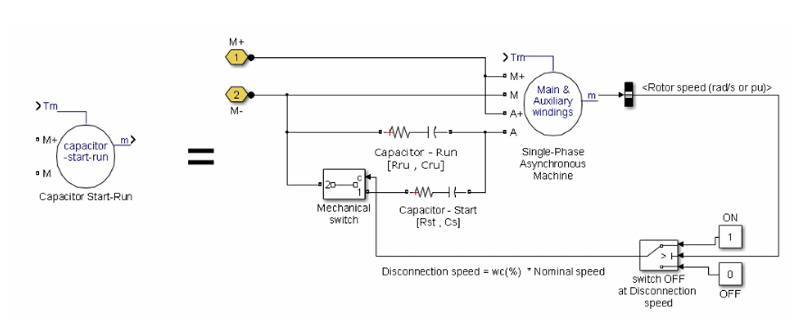

# Single-Phase Induction Motor with Starting Capacitor

Model Single-Phase Induction Motor with Starting Capacitor

Model Starting Capacitor

References:

https://ww2.mathworks.cn/help/sps/ug/single-phase-asynchronous-machine.html

https://ww2.mathworks.cn/help/sps/powersys/ref/singlephaseasynchronousmachine.html
